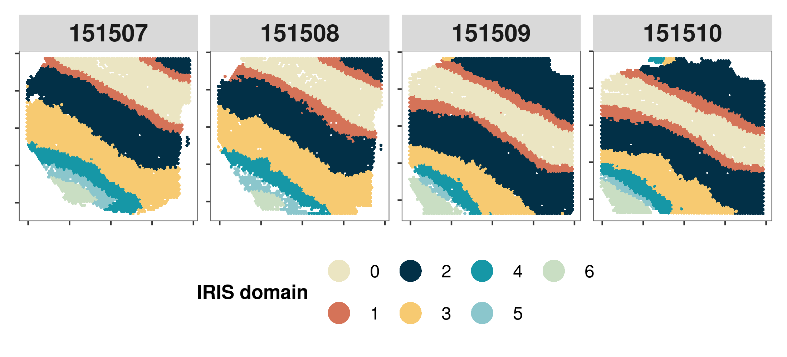
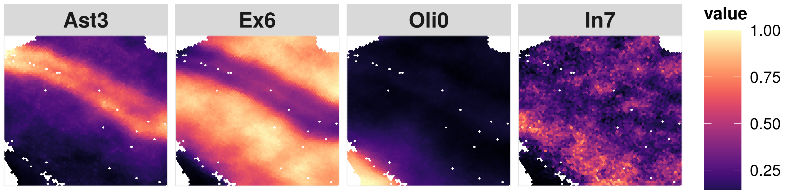

This tutorial is the example analysis with IRIS on the 10x Visium human dorsolateral pre-frontal cortex (DLPFC) spatial transcriptomics data from [Maynard et al, 2021](https://www.nature.com/articles/s41593-020-00787-0). Before running the tutorial, please make sure that the IRIS package was installed. Installation instructions see the [link](https://yingma0107.github.io/IRIS/documentation/02_installation.html)

## Required input data
`IRIS` requires two types of input data:
- A list of spatial transcriptomics count data across multiple slices, along with spatial location information for each tissue slice.  
- A reference single cell RNA-seq (scRNA-seq) count data, along with meta information indicating the cell type information and the sample (subject) information for each cell.  

The example data for running the tutorial can be downloaded in this [page](https://yingma0107.github.io/IRIS/documentation/03_data.html)
Here are the details about the required data input illustrated by the example datasets. 
### 1. spatial transcriptomics data, e.g.,
```r
#### read in the example spatial transcriptomics data
sp_input = readRDS("./countList_spatial_LIBD.RDS")
#### print the names of sp_input list
print(names(sp_input))
"spatial_countMat_list" "spatial_location_list"
#### extract the count data list and location list
spatial_countMat_list = sp_input$spatial_countMat_list
spatial_location_list = sp_input$spatial_location_list
#### check the count and spatial location, for example, the third tissue slice 151509
print(dim(spatial_countMat_list[[3]]))
[1] 33514  4730
print(dim(spatial_location_list[[3]]))
[1] 4730    2
```
The spatial transcriptomics count data for each tissue slice must be in the format of matrix or sparseMatrix, while each row represents a gene and each column represents a spatial location. The column names of the spatial data can be in the "XcoordxYcoord" (i.e., 10x10) format, but you can also maintain your original spot names, for example, barcode names. Correspondingly, the spatial location information for each tissue slice must be in the format of data frame or matrix, with each row matches with the spatial location in the spatial count data. and each column represents either the x coordinate or the y coordinate.

### 2. Reference single-cell RNAseq ((scRNA-seq)) data,  e.g.,
```r
#### read in the example reference scRNA-seq data, 
sc_input = readRDS("./scRef_input_mainExample.RDS")
#### extract the count data, metadata, column name indicating cell type annotation, and column name indicating samples/subjects.
sc_count = sc_input$sc_count
sc_meta = sc_input$sc_meta
ct.varname = sc_input$ct.varname
sample.varname = sc_input$sample.varname
#### check the sc_count data
print(sc_count[1:4,1:4])
4 x 4 sparse Matrix of class "dgCMatrix"
           AAACGGGAGATCCCGC.1 AAATGCCTCCAATGGT.1 AACCATGTCAGTGCAT.1
FO538757.2                  .                  1                  1
SAMD11                      .                  .                  .
NOC2L                       .                  .                  .
KLHL17                      .                  .                  .
           AACCATGTCTGTACGA.1
FO538757.2                  .
SAMD11                      .
NOC2L                       1
KLHL17                      .

```
The scRNA-seq count data must be in the format of matrix or sparseMatrix, while each row represents a gene and each column represents a cell.

```r
#### check the meta data
print(sc_meta[1:4,])
                                  TAG   projid cellType sampleID
AAACGGGAGATCCCGC.1 AAACGGGAGATCCCGC.1 11409232      Ex8        1
AAATGCCTCCAATGGT.1 AAATGCCTCCAATGGT.1 11409232      Ex0        1
AACCATGTCAGTGCAT.1 AACCATGTCAGTGCAT.1 11409232      Ex8        1
AACCATGTCTGTACGA.1 AACCATGTCTGTACGA.1 11409232      Ex0        1
```
The scRNAseq meta data must be in the format of data frame while each row represents a cell. The rownames of the scRNAseq meta data should match exactly with the column names of the scRNAseq count data. The sc_meta data must contain the column indicating the cell type assignment for each cell (e.g., "cellType" column in the example sc_meta data). Sample/subject information should be provided, if there is only one sample, we can add a column by ```sc_meta$sampleInfo = "sample1"```.

We suggest the users to check their single cell RNASeq data carefully before running IRIS. We suggest the users to input the single cell RNAseq data with each cell type containing at least 2 cells. i.e. print(table(sc_meta$cellType,useNA = "ifany"))

## Integrative and Reference-Informed Spatial Domain Detection for Spatial Transcriptomics
```r
library(IRIS)
``` 
### 1. Create an `IRIS` object
The IRIS object is created by the function `createIRISObject`. The essential inputs are:
- spatial_countMat_list A list of raw spatial resolved transcriptomics count data across multiple slices. In each tissue slice, it is a sparse matrix with each column is a spatial location, and each row is a gene. 
- spatial_location_list A list of spatial location data frames across multiple slices, with two columns representing the x and y coordinates of the spatial location (The column names must contain "x" and "y"). The rownames of this data frame should match exactly with the columns of the corresponding spatial_count in the spatial_countMat_list. The order of the tissue slices in the spatial_location_list must match with the order of that in the spatial_countMat_list
- sc_count Reference scRNA-seq count data, each column is a cell and each row is a gene.
- sc_meta A data frame of meta data providing information on each cell in the sc_count, with each row representing the cell type and/or sample information of a specific cell. The row names of this data frame should match exactly with the column names of the sc_count data
- ct.varname character, the name of the column in metaData that provides the cell type annotation information for IRIS to perform informed domain detection.
- sample.varname character,the name of the column in metaData that specifies the sample information. If NULL, we just use the whole as one sample.
- minCountGene Minimum counts for each gene in the spatial count data, default is 100
- minCountSpot Minimum counts for each spatial location in the spatial count data, default is 5

```r
IRIS_object <- createIRISObject(
spatial_countMat_list = spatial_countMat_list,
spatial_location_list = spatial_location_list,
sc_count = sc_count,
sc_meta = sc_meta,
ct.varname = ct.varname,
sample.varname = sample.varname,
minCountGene = 100,
minCountSpot =5) 
```
The spatial data are stored in `IRIS_obj@spatial_countMat` and `IRIS_obj@spatial_location` while the scRNA-seq data is stored in IRIS_obj@sc_eset in the format of SingleCellExperiment. 

### 2. Integrative spatial domain detection using IRIS
Now we have everything stored in the IRIS object, we can use IRIS to perform the integrative and reference-informed spatial domain detection for spatial transcriptomics. IRIS is computationally fast and memory efficient. IRIS relies on an efficient optimization algorithm for constrained maximum likelihood estimation and is scalable to spatial transcriptomics with tens of thousands of spatial locations and tens of thousands of genes. For the example dataset with four tissue slices in 17780 spatial locations, it takes within 5 minutes to finish the analysis. 

```r
#### preselect the number of spatial domains 
numCluster = 7
#### perform the integrative and refernce-informed domain detection
IRIS_object <- IRIS_spatial(IRIS_object,numCluster = numCluster)
```
The results of detected domains are stored in `IRIS_obj@spatialDomain`. 
```r
print(IRIS_obj@spatialDomain[1:2,])
      Acinar_cells Ductal_terminal_ductal_like
10x10 6.370860e-02                  0.02391251
10x13 7.818278e-08                  0.02996182
      Ductal_CRISP3_high-centroacinar_like Cancer_clone_A Ductal_MHC_Class_II
10x10                            0.1801753   4.229928e-04         0.021557706
10x13                            0.9620440   1.910394e-07         0.006437371
      Cancer_clone_B      mDCs_A Ductal_APOL1_high-hypoxic   Tuft_cells
10x10   4.339480e-05 0.011136707              4.967235e-04 2.025089e-03
10x13   2.319262e-05 0.001013068              3.864917e-06 1.796433e-06
            mDCs_B         pDCs Endocrine_cells Endothelial_cells Macrophages_A
10x10 0.0792525811 7.432979e-07    6.848627e-03      1.722855e-01  9.909662e-02
10x13 0.0004695018 1.566377e-11    3.925412e-11      4.198468e-11  2.766705e-05
        Mast_cells Macrophages_B T_cells_&_NK_cells    Monocytes        RBCs
10x10 7.411147e-11  3.090675e-02       4.976256e-06 2.663846e-06 3.84187e-10
10x13 2.387132e-11  9.499908e-06       1.172387e-11 2.000116e-06 1.00967e-06
       Fibroblasts
10x10 3.081225e-01
10x13 4.898874e-06
```
### 3. Visualize the spatial domains detected by IRIS
First, we jointly visualize the spatial domains detected by IRIS across multiple slices through scatter plot. In this plot, each panel represents on tissue slice with x and y axis represents the coordiates while each point is colored by their spatial domains.
```r
#### set the colors. Here, I just use the colors in the manuscript, if the color is not provided, the function will use default color in the package. 
colors = c("#ebe5c2", "#D57358", "#023047", "#F7CA71", "#1697a6", "#8bc6cc", "#C9DEC3")
#### extract the domain labels detected by IRIS
RIS_domain =  IRIS_object@spatialDomain[,c("Slice","spotName","IRIS_domain")]
#### relevel the spatial domains, to make it consistent with the orders from Layer 1 to Layer 6 to white matter.
IRIS_domain$IRIS_domain = plyr::mapvalues(IRIS_domain$IRIS_domain,from = c(0:6), to = c(5,2,3,1,0,4,6))
#### extract the spatial location information
spatial_location = IRIS_object@spatialDomain[,c("x","y")]
spatial_location$x = IRIS_object@spatialDomain$y
spatial_location$y = -IRIS_object@spatialDomain$x #### make it consistent with many previous visualizations on this tissue. Note that this is only for visualization purpose.
p1 = IRIS.visualize.domain(IRIS_domain,spatial_location,colors = colors,numCols = 4)
print(p1)
```
Here is an example output: 


### 4. Visualize the cell type proportions seperately
As a secondary output of IRIS, IRIS is also able to generate the cell type proportion distributions for each slice. 
```r
#### Here we use the third slice 151509 as an example
#### select the cell type that we are interested
ct.visualize = c("Ast3","Ex6","Oli0","In7")
#### visualize the spatial distribution of the cell type proportion
library(viridis)
#### set the color values
colors = magma(256)
#### extract the cell type proportion matrix for the example slice
IRIS_prop = IRIS_object@IRIS_Prop
IRIS_prop = IRIS_prop[IRIS_prop$Slice == "151509",]
#### extract the spatial information matrix for the example slice
IRIS_prop_location = IRIS_prop[,c("Slice","spotName","x","y")]
#### This is only for visualization purpose
IRIS_prop_location$x = IRIS_prop$y
IRIS_prop_location$y = -IRIS_prop$x

p2 <- IRIS.visualize.prop(
	proportion = IRIS_prop,        
	spatial_location = IRIS_prop_location, 
	ct.visualize = ct.visualize,                 #### selected cell types to visualize
	colors = colors,                             #### if not provide, we will use the default colors
	NumCols = 4)                                 #### number of columns in the figure panel
print(p2)

```
Here is an example output: 
<p align="left"> 

</p>
